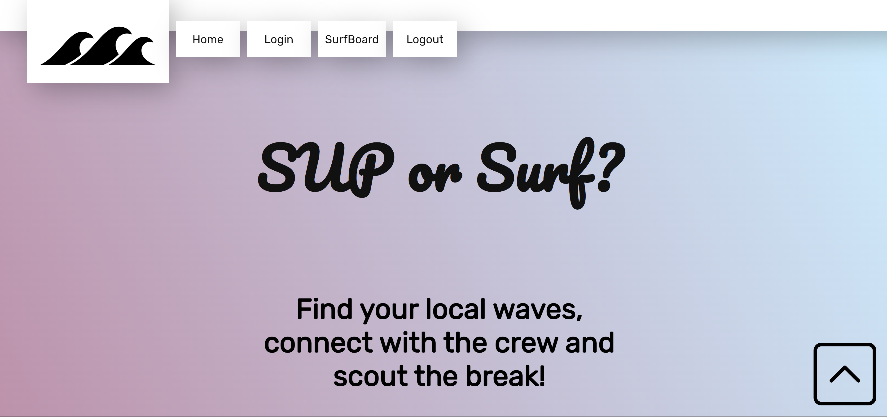

# Project 2 - Surf or Sup
## Site Application
Surf or Sup was created to entertain the surfing enthusiast by providing a far out application where they can conveniently look up weather and tide reports for any beach worldwide, surf the site for the best surfing gear and equipment, sign up or sign in and see or post tubular surfing tips and beach reviews and stay up to date with everything surfing related.

## User Story
```
AS A Surfing aficionado
I WANT to be able to be in the know with everything from cool surfing spots to weather outlooks at my local beach or desired destinations. I also want to be able to join the surfing community
SO THAT I can stay informed with all there is to surfing and even share my awesome surfing stories and insights.
```

## Acceptance Criteria
``` 
GIVEN I need a surfing application that is informative and interactive 
WHEN I load the website
THEN I am presented with a unique website where you can sign up and/or sign in
WHEN I click on the "home" button
THEN I am taken back to the homepage or the homepage is refreshed
WHEN I click on the "login" button
THEN I am taken to the sign up or login page
WHEN I click the "surfboard" button
THEN I am taken to the dashboard
WHEN I fill in the inputs to create a new surfboard 
THEN I click create and make my first post
WHEN I click the scroll to the top button
THEN I am taken to the top of the page
WHEN I enter my login info
THEN I am logged in and taken to the dashboard
WHEN I click logout 
THEN I am logged out of my account
``` 
## Features

#### Welcome Page
* Users have the option to sign up or login, check weather info or simply surf the site for a multitude of resources.

#### Explore The Waves
* Our comprehensive database provides detailed information on wave conditions, tides, and local amenities. 

#### Gear Up For Adventure
* From boards to wetsuits, find the best equipment curated by our experts.

#### Expert Reviews And Recommendations
* Our team of seasoned surfers and paddlers provide in-depth reviews and personalized recommendations based on your preferences and skill level.

#### Latest Forecasts, News, And Updates
* Stay up-to-date with the latest trends, news, and events in the surfing and paddleboarding world. Get insider tips on technique, safety, and gear.
* Plan your sessions with precision. Access accurate weather forecasts and tide information tailored to your location.


## Usage & Deployment Link

- Click <a href="https://github.com/kfitzGazz/project2-UM">here</a> to visit our GitHub
- Click <a href="">here</a> to hang ten with Surf or Sup!

</img>

## Installation & Contributors
<table border="1">
 <tr>
    <td><b style="font-size:20px">Installation</b></td>
    <td><b style="font-size:20px">Team Members</b></td>
 </tr>
 <tr>
    <td>
        <li>Create Repo in Github</li>
        <li>Install package-lock.json  </li>
        <li>Downloaded Node.js package manager and npm.  </li>
        <li>Install tailwind CSS  </li>
        <li>Create database</li>
        <li>Create organized handlebars format</li>
        <li>README.md</li>
        <li>Deployment</li>
    </td>
<td>
    <ol>
        <li><a href ="https://github.com/bizwliz">Lissette Garcia</a></li>
        <li><a href ="https://github.com/ekovalchick">Elizabeth Kovalchick</a></li>
        <li><a href ="https://github.com/kfitzGazz">Kyleigh Fitzgerald Gazzolo</a></li>
        <li><a href ="https://github.com/felipesierra10">Felipe Sierra</a></li>
        </ol>
    </td>
</tr>
</table>

## Credits
- <a href="https://tailwindcss.com/">TailwindCSS</a>
- <a href="https://www.free-css.com/free-css-templates/page239/surf-camp">CSS Template</a>

## Tests & License

- Tested Using Visual Studio Code
- [MIT License](https://opensource.org/licenses/MIT)
- - -
© 2023 Surf or Sup